# distgo

A Distributed Go Compiler.

This is a Lab project in [Distributed Systems Course](https://studiegids.vu.nl/en/courses/2023-2024/X_400130#/) authored by Hanjun Liu and Sebastiaan Gerritsen, under the supervision of Sacheendra Talluri.

You can read more details from the [report](.github/report.pdf)
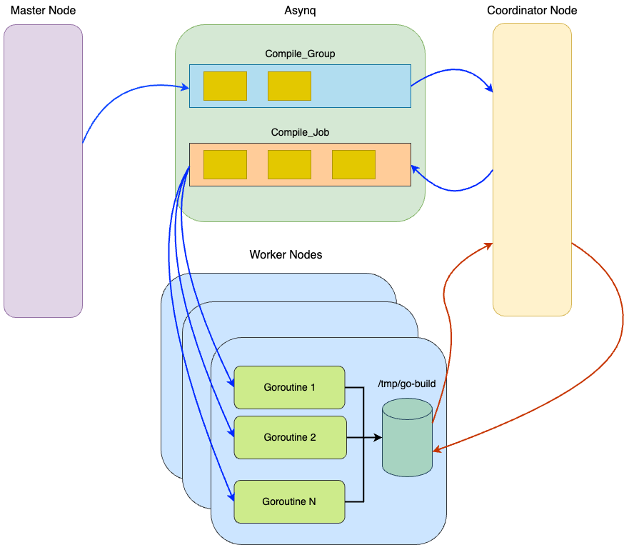
## Architecture
* ***Master***: responsible for generating all the commands required for compilation on the head node. It organizes these commands into various dependency-based groups. Within each group, commands are independent of each other and can be run simultaneously on multiple nodes on DAS-5. Once organized, the master node dispatches these groups to the asynchronous task queue named `Compile_Group`.
* ***Coordinator***: to extract groups from the `Compile_Group` task queue and break them down into single command tasks and send them to the `Compile_Job` task queue. These tasks are then executed across multiple worker nodes. It manages the compilation process in a sequential manner, extracting each group one after the other. Additionally, the coordinator node is responsible for synchronizing the build result files across the worker nodes, ensuring a cohesive and efficient compilation process.
* ***Worker***: operates on a DAS-5 node. Its ongoing function is to continuously retrieve jobs from the `Compile_Job` task queue and execute them.
## Installation and Usage on DAS-5

### 1. Build this project
```bash
git clone https://github.com/badbubble/distgo && cd distgo/
make
```
### 2. Configuring the System
Update all configurations in the `configs/` directory for Redis and Asynq.
```yaml
redis:
  host: ""
  port: 6379
  password: ""
  db: 0
  pool_size: 100

asynq:
  host: ""
  port: 6379
  password: ""
  concurrency: 1
```
### 3. Loading the DAS-5 Module
``` bash
module load prun
```

### 4. Deploying Worker Nodes
```bash
prun -v -NUMBER_OF_WORKERS -np NUMBER_OF_NODES ./worker
```
### 5. Configuring the Coordinator
Update the `configs/coordinator.yaml` file to include the IP addresses of the nodes. These IP addresses can be obtained from the initial output lines in step 4.
```bash
cluster:
  hosts:
    - "10.141.0.54"
    - "10.141.0.55"
    - "10.141.0.56"
    - "10.141.0.68"
    - "10.141.0.59"
    - "10.141.0.60"
    - "10.141.0.62"
    - "10.141.0.63"
```
### 6. Running Coordinator Nodes
```bash
./coordinator
```
### 7. Compiling
```bash
./master -p PATH_TO_THE_PROJECT -m PATH_TO_THE_MAIN_FILE
```
## Performance Analysis
### alist
Compilation Time             |                   Exchange Dependencies Time                   |  Distribute Commands Time
:-------------------------:|:--------------------------------------------------------------:|:-------------------------:
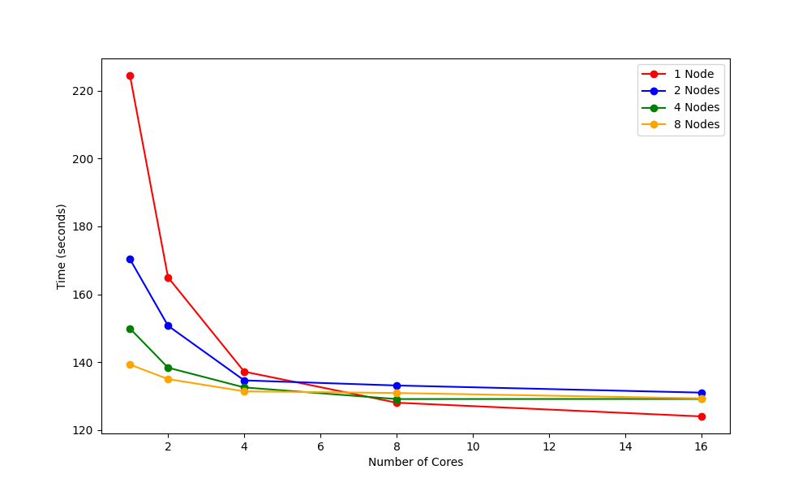 | 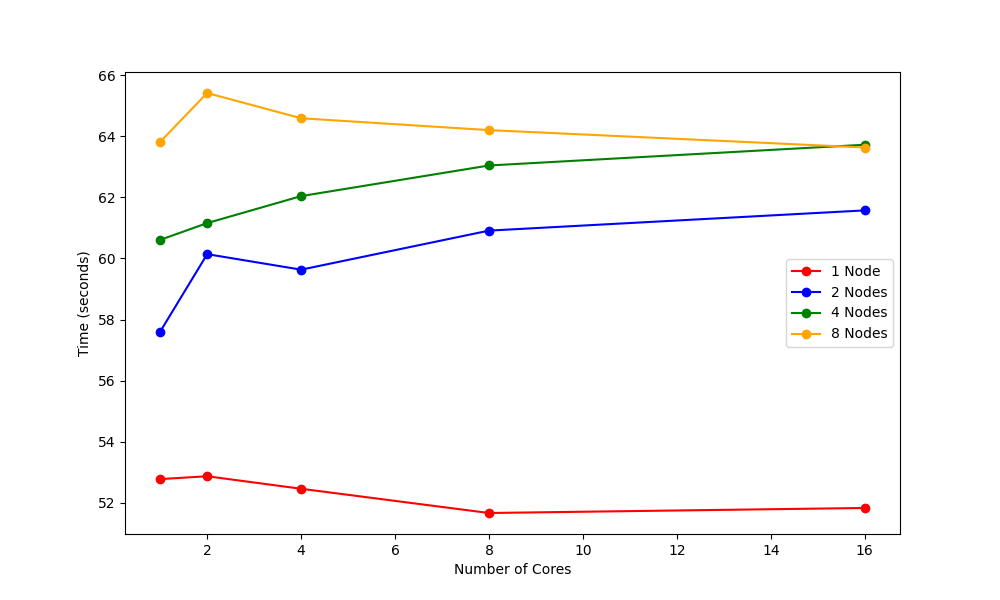 | 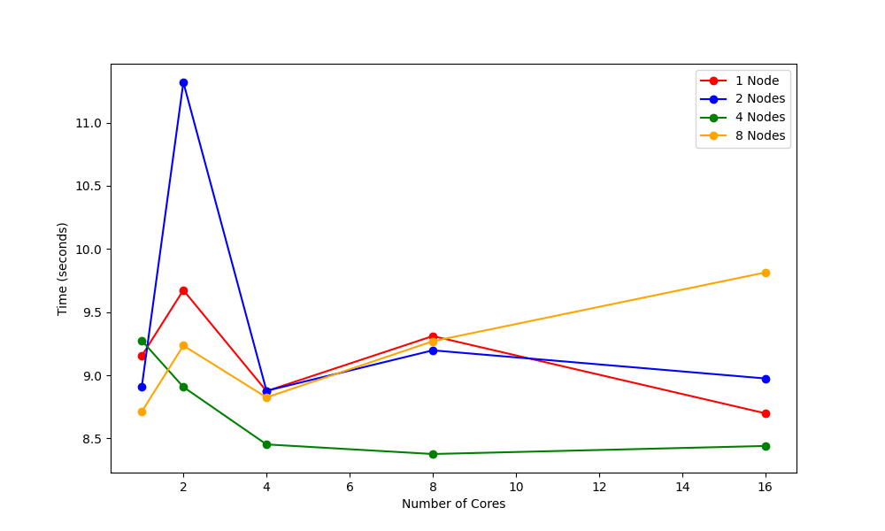

### osmedeus
Compilation Time             |                    Exchange Dependencies Time                     |  Distribute Commands Time
:-------------------------:|:-----------------------------------------------------------------:|:-------------------------:
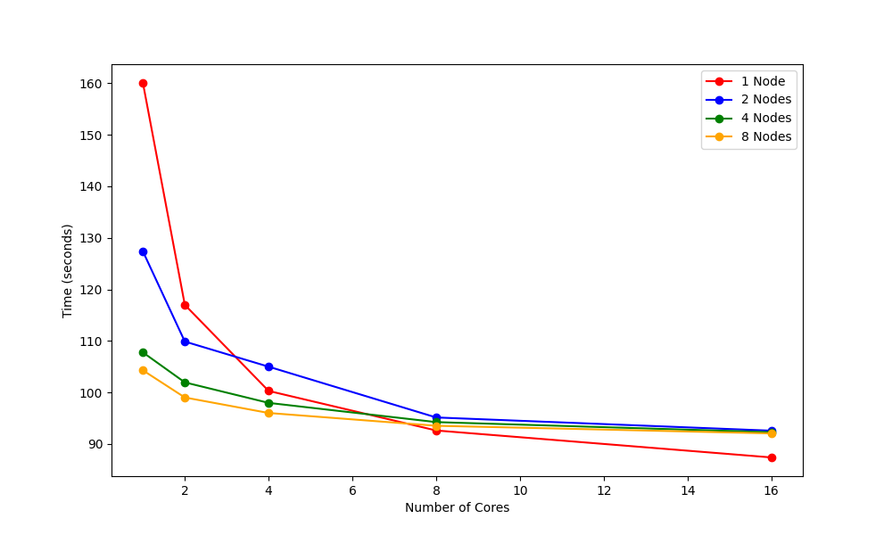 | 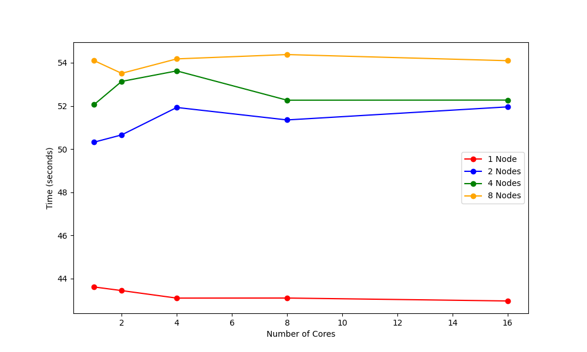 | 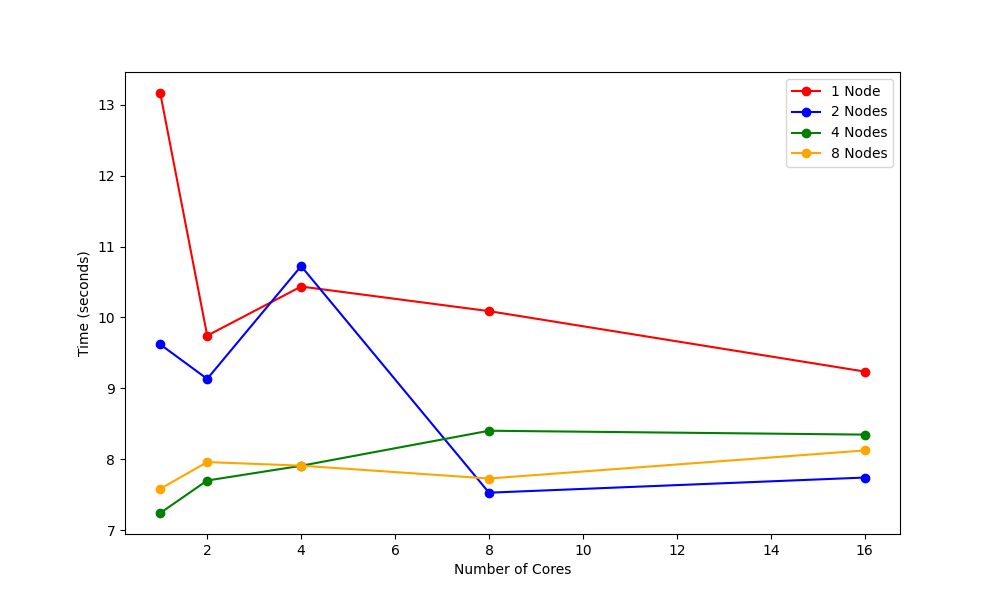
### go-redis
Compilation Time             |                    Exchange Dependencies Time                     |  Distribute Commands Time
:-------------------------:|:-----------------------------------------------------------------:|:-------------------------:
 | 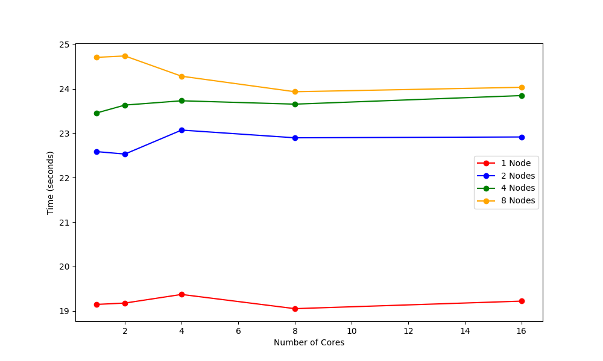 | 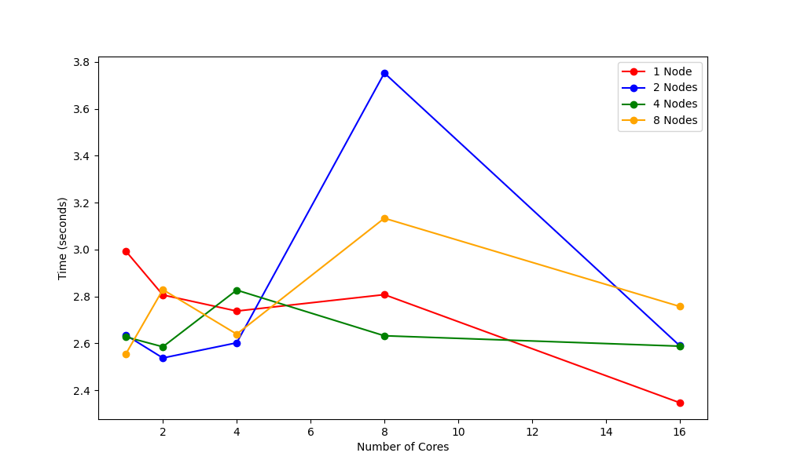

### go-cycle
Compilation Time             |                    Exchange Dependencies Time                     |  Distribute Commands Time
:-------------------------:|:-----------------------------------------------------------------:|:-------------------------:
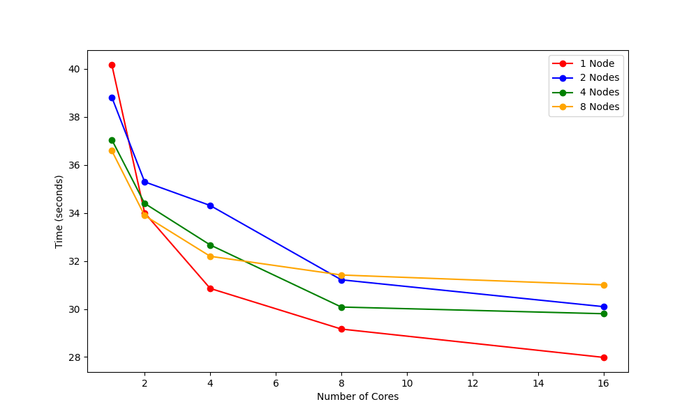 | 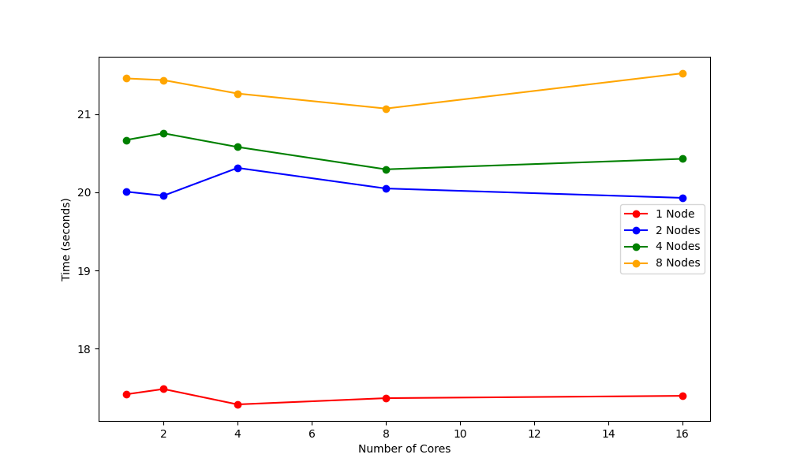 | 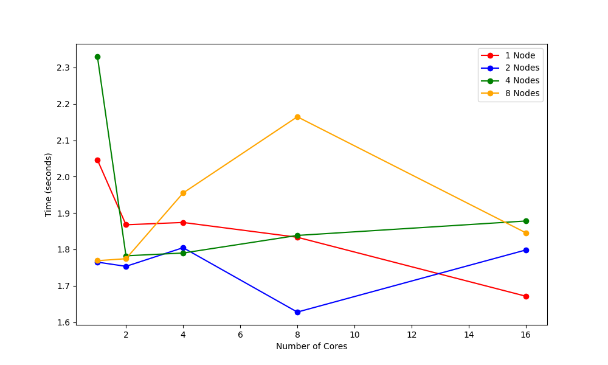

### BubblePL-Go
Compilation Time             |                    Exchange Dependencies Time                     |  Distribute Commands Time
:-------------------------:|:-----------------------------------------------------------------:|:-------------------------:
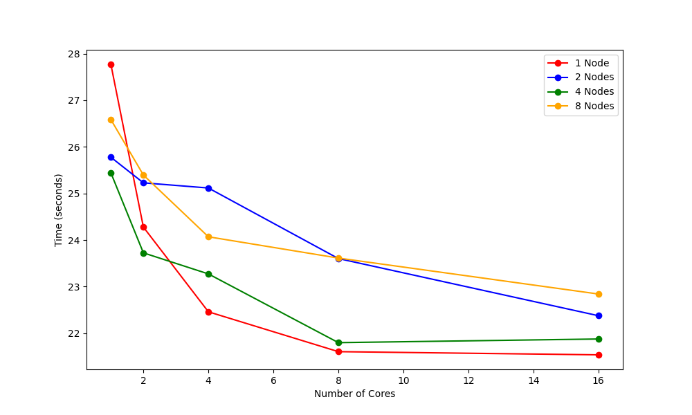 | 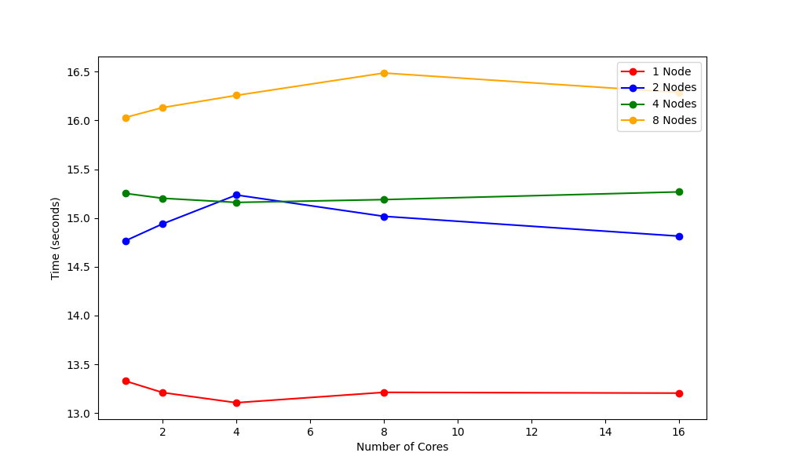 | 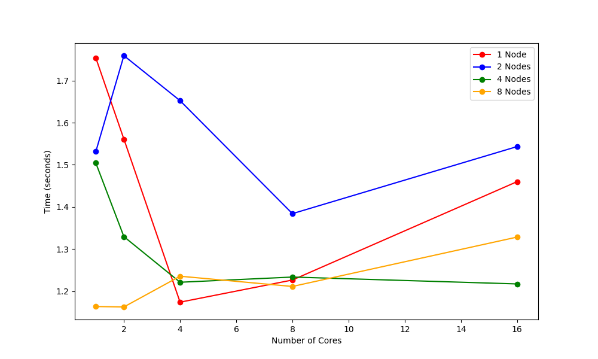

## Tests
* [alist](https://github.com/alist-org/alist)
* [tdl](https://github.com/iyear/tdl)
* [gg](https://github.com/mzz2017/gg)
* [simplebank](https://github.com/techschool/simplebank)
* [Bubble-Go](https://github.com/badbubble/BubblePL-Go)
* [distgo](https://github.com/badbubble/distgo)
* [osmedeus](https://github.com/j3ssie/osmedeus)
* [go-gin-example](https://github.com/eddycjy/go-gin-example)
* [go-cyclic](https://github.com/elza2/go-cyclic)
* [wego](https://github.com/schachmat/wego)

##